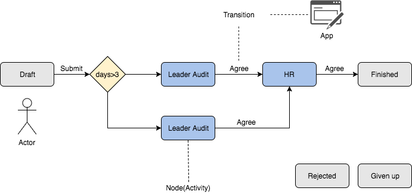

=============
Core concepts
=============

.. _`core_concepts`:

``django-lb-workflow`` is ``Activity-Based Workflow``.
Activity-based workflow systems have workflow processes comprised of activities
to be completed in order to accomplish a goal.

Half Config
-----------

``django-lb-workflow`` is ``half config``.

- ``Data model``/``action``/``Layout of form`` is written by code.
    - They are too complex to config and the change is not too often.
- The node(activity) and transition is configurable.
    - The pattern is clear and the change is often.

Data model
----------

Config
######

**Process**

A process holds the map that describes the flow of work.

The process map is made of nodes and transitions. The instances you create on the
map will begin the flow in the draft node. Instances can be moved forward from node
to node, going through transitions, until they reach the end node.

**Node**

Node is the states of an instance.

**Transition**

A Transition connects two node: a From and a To activity.

Since the transition is oriented you can think at it as being a
link starting from the From and ending in the To node.
Linking the nodes in your process you will be able to draw the map.

Each transition can have a condition that will be tested
whether this transition is available.

Each transition is associated to a app that define an action to perform.

**App**

An application is a python view that can be called by URL.

Runtime
#######

**ProcessInstance**

A process instance is created when someone decides to do something,
and doing this thing means start using a process defined in ``django-lb-workflow``.
That's why it is called "process instance". The process is a class
(=the definition of the process), and each time you want to
"do what is defined in this process", that means you want to create
an INSTANCE of this process.

So from this point of view, an instance represents your dynamic
part of a process. While the process definition contains the map
of the workflow, the instance stores your usage, your history,
your state of this process.

**Task**

A task object represents a task you are performing.

**Event**

A task perform log.

**BaseWFObj**

A abstract class for flow model. Every flow model should inherit from it.

User Parser
-----------

``django-lb-workflow`` use a text field to config users for ``Node``
and user a parser to cover it to Django model. The default parser is
``lbworkflow.core.userparser.SimpleUserParser``. You can replace it with your implement.

Views and Forms
---------------

``django-lb-workflow`` provide a set of views and forms to customized flow.

Classes for create/edit/list process instance is in ``lbworkflow/views/generics.py``.

Classes for customize transition is in ``lbworkflow/views/transition.py``.

Classes for customize form is in ``lbworkflow/views/forms.py``.

url provide by ``django-lb-workflow``
#####################################

you can find all url in ``lbworkflow/urls.py``

- Main entrance.
    - ``wf_todo`` List tasks that need current user to process.
    - ``wf_my_wf`` List processes that current user submitted.
    - ``wf_start_wf`` List the processes that current user can submit.
    - ``wf_report_list`` Each process have a default report. This url will list all report link.
- Flow
    - ``wf_new [wf_code]`` Submit a new process. ``wf_code`` used to specify which process to submit.
    - ``wf_edit [pk]`` Edit a process.
    - ``wf_delete`` Delete a process.
    - ``wf_list [wf_code]`` Default report for a process. ``wf_code`` used to specify the process.
    - ``wf_detail [pk]`` Display the detail information for a process.
    - ``wf_print_detail [pk]`` A page to display process information used for print.
- Actions(App)
    - ``wf_agree`` Agree a process.
    - ``wf_back_to`` Rollback process to previous node.
    - ``wf_reject`` Reject a process.
    - ``wf_give_up`` Give up a process.
    - ``wf_batch_agree``
    - ``wf_batch_reject``
    - ``wf_batch_give_up``
    - ``wf_execute_transition`` Execute a transition for a process.
    - ``wf_execute_transition [wf_code] [trans_func]`` Execute a transition for a process with customize function.
